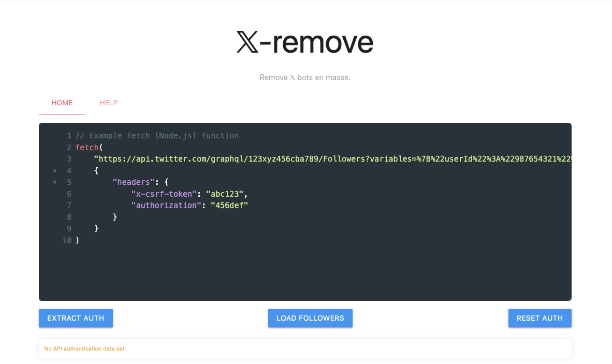
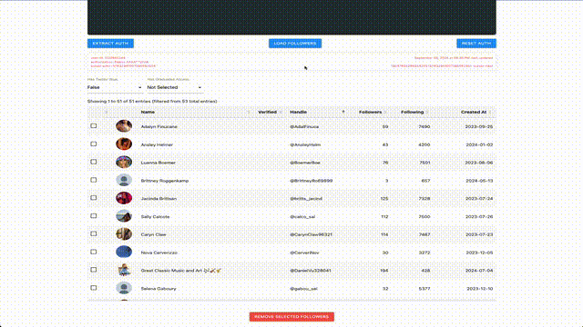

# x-remove

𝕏 bot removal tool.

## Usage

1. Set up the credentials.
   1. Open 𝕏 in your browser.
   2. Open developer tools' network tab.
   3. Navigate to your profile's followers list.
     a. Make sure you open the whole follower list, not just the verified followers.
   4. Look for a request to the `/Followers` endpoint.
   5. Copy the request as *fetch (Node.js)* and paste it into 𝕏-remove.
   6. Extract the API authorization data.
2. Remove bots.
   1. Load your first 50 followers.
   2. Tick the checkbox to stage a follower for removal.
   3. Click the big red botton at the bottom to remove ticked follower.

## Privacy & Security

A proxy server is necessary to make cross-origin requests to 𝕏. The server retains minimal data. Logs that include your user ID and the removed follower's ID are kept. Everything else is in your browser.

𝕏-remove requires TLS encryption so your authorization token is private.
